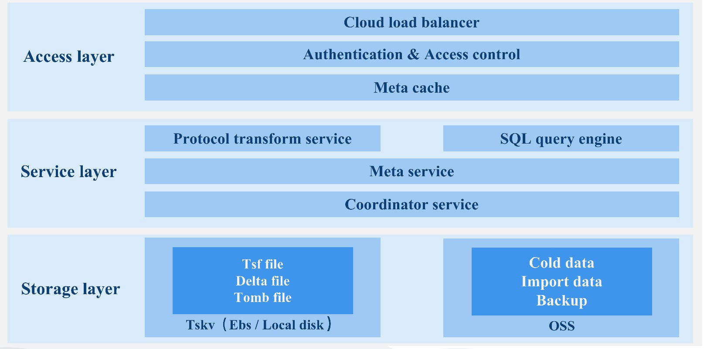

English | [简体中文](./README_CN.md)

CnosDB is An Open Source Distributed Time Series Database with high performance, high compression ratio and high
usability.

CnosDB Isipho is an original new version of CnosDB which use Rust, [Apache Arrow](https://arrow.apache.org/)
and [DataFusion](https://github.com/apache/arrow-datafusion) to build.

## Design Objectives of CnosDB2.0

To design and develop a high performance, high compression ratio, highly available, distributed cloud native time series
database, which meets the following objectives.

> Time Series Database

1. Extensibility, theoretically support time series without upper limit, completely solve the problem of time series
   inflation, support horizontal/vertical expansion.
2. Separate storage and computation. Compute nodes and storage nodes can expand and shrink independently.
3. High-performance storage and low cost, high-performance I/O stacks, cloud disk and object storage for storage tiering
4. Query engine supports vectorized queries.
5. Supports multiple timing protocols to write and query, and provides external components to import data.

> Cloud Native

1. Supports cloud native, making full use of the convenience brought by cloud infrastructure and integrating into cloud
   native ecology.
2. High availability, second-level fault recovery, multi-cloud, and multi-zone disaster recovery and preparedness.
3. Native support multi-tenant, pay-as-you-go.
4. CDC, logs can be subscribed to and distributed to other nodes.
5. More configurable items are provided to meet the complex requirements of public cloud users in multiple scenarios.
6. Cloud edge - end collaboration provides the edge - end integration capability with the public cloud
7. Converged OLAP/CloudAI data Ecosystem on the cloud.

## CnosDB Architecture

## Roadmap

- Click to view [Roadmap](./docs/roadmap/ROADMAP.md)

## Join the community

All developers/users who love time series databases are welcome to participate in the CnosDB User Group. Scan the QR
code below and add CC to join the group.

Please check [Instructions for joining the group](./docs/guidelines/CnosDBWeChatUserGroupGuidelines.md) beforehand.

## Contributing

* To compile the code by hand, please refer to [Quick Start](docs/get-started.md)。
* Please refer to [Contribution Guide](./CONTRIBUTING_EN.md) to contribute to CnosDB.

## Contact

* [Home page](https://cnosdb.com)

* [Stack Overflow](https://stackoverflow.com/questions/tagged/cnosdb)

* [Twitter:@CnosDB](https://twitter.com/CnosDB)

* [LinkedIn Page](https://www.linkedin.com/company/cnosdb)

* [Bilibili](https://space.bilibili.com/36231559)

* [Tiktok CN](https://www.douyin.com/user/MS4wLjABAAAA6ua1UPmYWCcTl0AT0Lf1asILf9ogmj7J257KEq812csox9FBrAkxxKcok1GIzPMv)

* [Zhihu](https://www.zhihu.com/org/cnosdb)

* [CSDN](https://blog.csdn.net/CnosDB)

* [Jianshu](https://www.jianshu.com/u/745811688e9e)

## We are hiring

* If you want to get a job of full-time/part-time/intern, please send us resume by email hr@cnosdb.com

## License

* [AGPL-3.0 License](./LICENSE.md)
