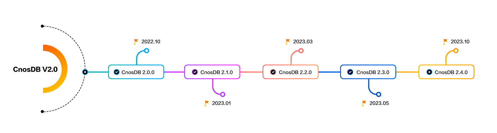

# CnosDB2.0 Road Map

## The Overall Design Objectives of CnosDB 2.0

To design and develop a high performance, high compression ratio, highly available, distributed cloud native time series
database, which meets the following objectives.

### Time Series Database

1. Extensibility, theoretically support time series without upper limit, completely solve the problem of time series
   inflation, support horizontal/vertical expansion.
2. Separate storage and computation. Compute nodes and storage nodes can expand and shrink independently.
3. High-performance storage and low cost, high-performance I/O stacks, cloud disk and object storage for storage tiering
4. Query engine supports vectorized queries.
5. Supports multiple timing protocols to write and query, and provides external components to import data.

### Cloud Native

1. Supports cloud native, making full use of the convenience brought by cloud infrastructure and integrating into cloud
   native ecology.
2. High availability, second-level fault recovery, multi-cloud, and multi-zone disaster recovery and preparedness.
3. Native support multi-tenant, pay-as-you-go.
4. CDC, logs can be subscribed to and distributed to other nodes.
5. More configurable items are provided to meet the complex requirements of public cloud users in multiple scenarios.
6. Cloud edge - end collaboration provides the edge - end integration capability with the public cloud
7. Converged OLAP/CloudAI data Ecosystem on the cloud.

### The Design Objectives of CnosDB 2.4

CnosDB V version 2.4.0 will achieve: add timing functions, add lossy compression algorithms, support update and delete operations and have a master replication group, this version of CnosDB will be able to provide users with a higher performance, easier to operate, more comprehensive data processing capabilities of the open source timing database, described in detail below.
#### The Space-Time Function 
Support space type and space-time function, space type will be supported in the standard WKT and WKB mode, supported space-time function including but not limited to position calculation, area calculation, moving speed calculation, etc. 
#### Advanced Functions 
Common functions (first, last, max, min), date conversion class, monitoring class (gauges calculation).
#### Lossy Compression
- Deadband Compression ：A data compression algorithm used to reduce the frequency of sensor data updates and reduce data transmission and storage costs.
- Swinging Door Trending (SDT)  Algorithm ：A real-time data stream processing algorithm that can be used to process dynamic data sets, maintaining the number of elements in the data set by constantly adjusting the size of the gate.
#### Support Schema change 
Support Update、Delete operations.
#### Add Master-Slave replicaset 
Implements exactly once semantics for processing stream data.

